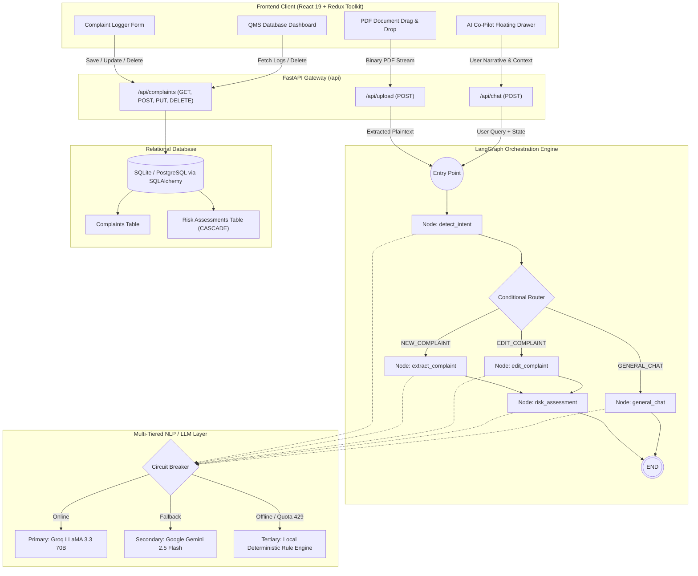
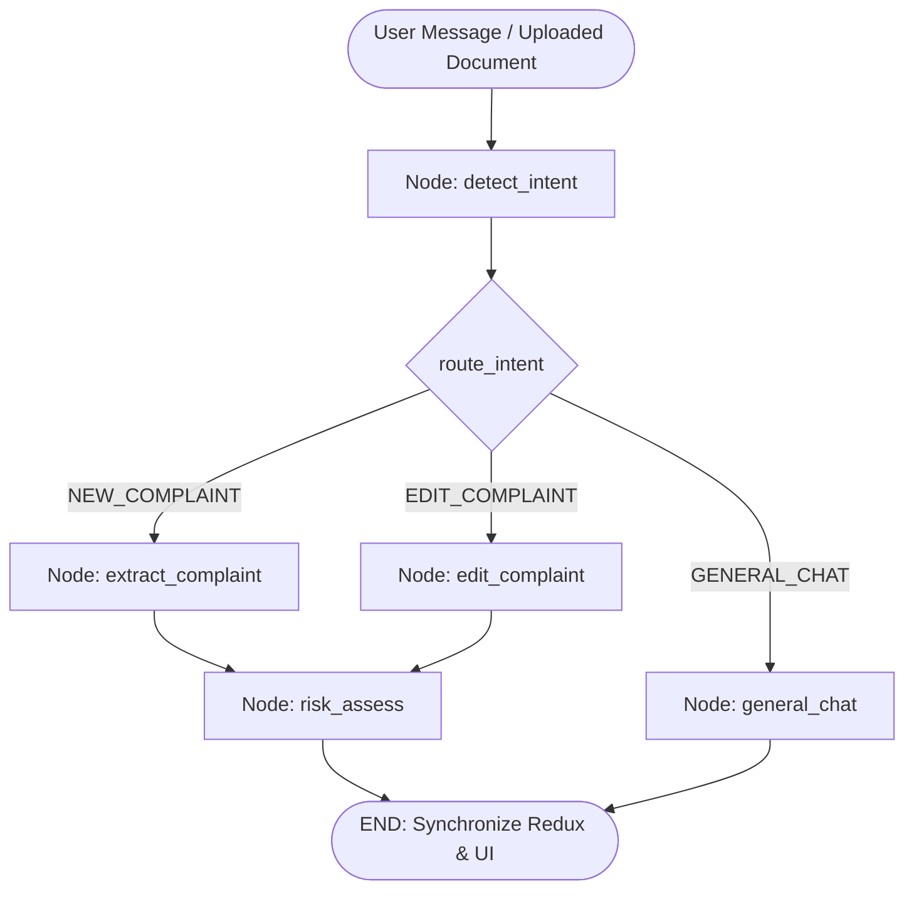
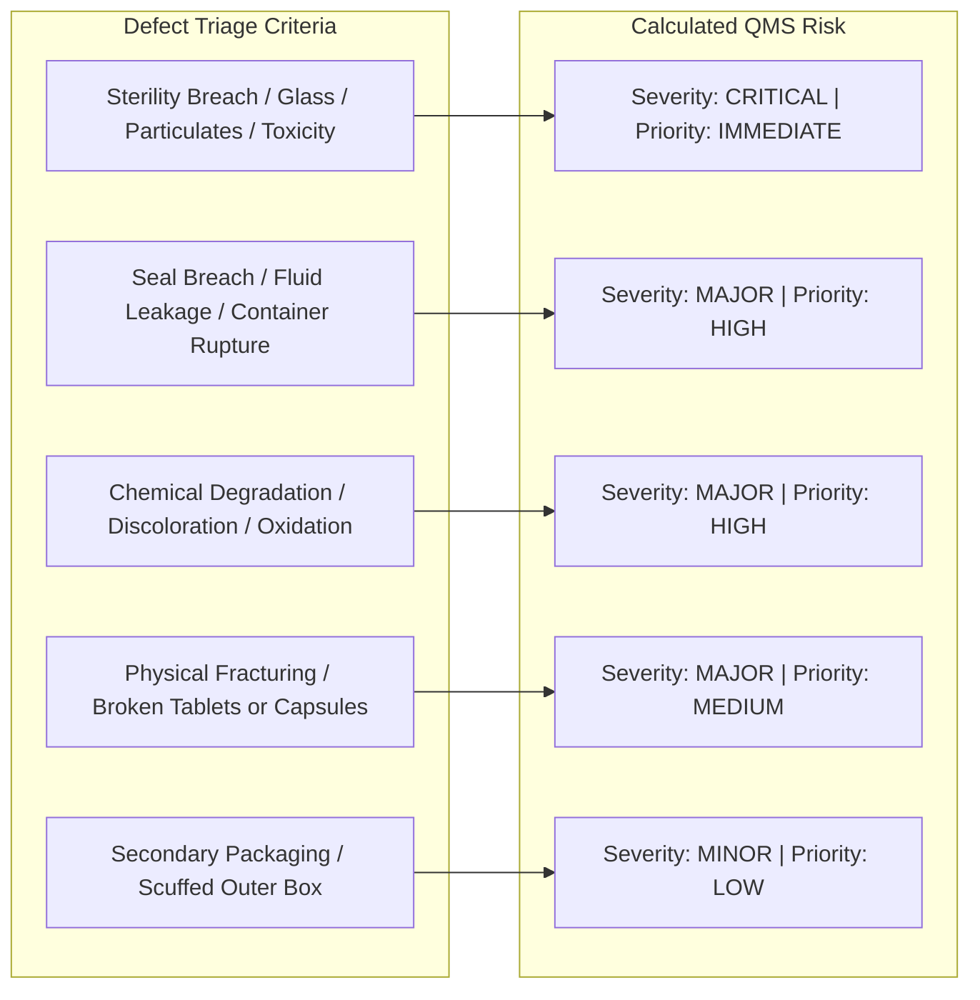
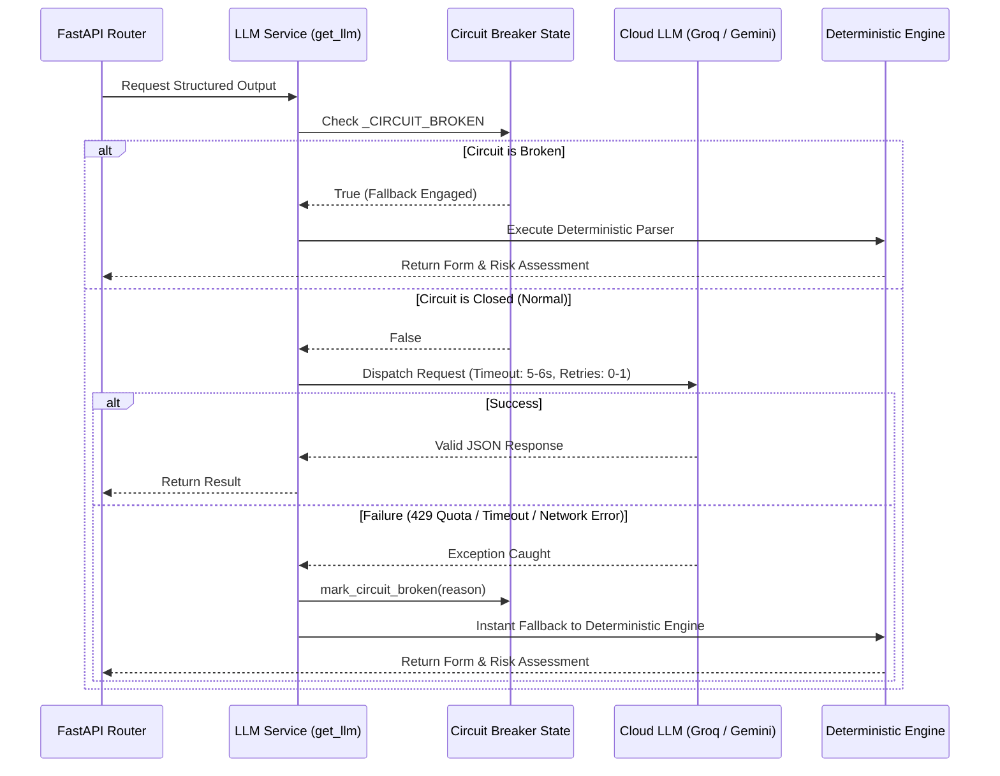
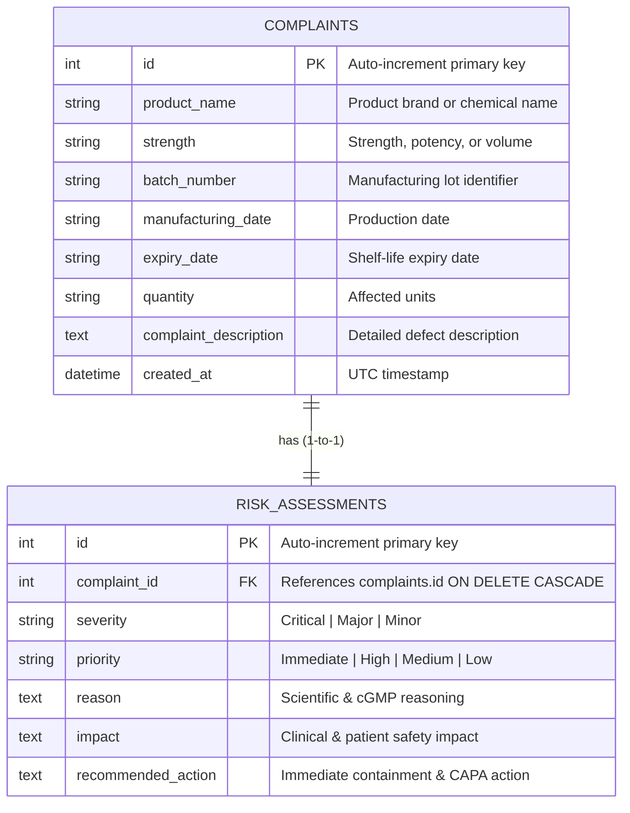
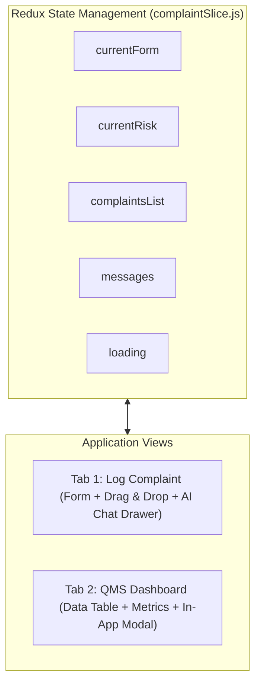

# ComplaintLens: Technical Architecture & NLP/LangGraph Implementation Guide

---

## 1. Executive Summary & System Vision

**ComplaintLens** is an automated, cGMP-ready Quality Management System (QMS) complaint processing platform tailored for pharmaceutical, life sciences, and regulated consumer product industries. 

In traditional enterprise quality workflows, processing customer complaints is labor-intensive, error-prone, and slow. Complaints arrive through disparate channels—free-text emails, call-center transcripts, customer service portals, or scanned inspection PDF reports. Human QA personnel must manually transcribe product identifiers, verify batch records, assess clinical severity, assign priority, and cross-reference Standard Operating Procedures (SOPs) to recommend Corrective and Preventive Actions (CAPA).

### What ComplaintLens Solves
1. **Automated Multimodal Ingestion**: Ingests raw conversational text and multi-page PDF documents.
2. **Zero-Loss Entity Extraction**: Accurately extracts complex entities (e.g., Product Name, Strength, Batch/Lot Number, Manufacturing Date, Expiration Date, Affected Quantity, Defect Description) across pharmaceutical and consumer product domains.
3. **Deterministic State Machine Orchestration**: Uses **LangGraph** to govern the workflow, enforcing strict transitions between intent detection, extraction, conversational editing, and automated risk scoring.
4. **Automated cGMP Risk & SOP Determination**: Evaluates complaint descriptions against regulatory matrices (US FDA 21 CFR Part 211.198 and EU GMP Chapter 8) to classify severity (*Critical*, *Major*, *Minor*), establish triage priority (*Immediate*, *High*, *Medium*, *Low*), and formulate actionable SOP containment steps (e.g., warehouse quarantine, Class I/II recall assessments, laboratory HPLC assays).
5. **High-Availability Hybrid Engine**: Combines state-of-the-art Large Language Models (LLMs) with a robust, zero-downtime deterministic regex and heuristic rules engine backed by an automatic circuit breaker.

---

## 2. End-to-End System Architecture

ComplaintLens is built on a decoupled, microservice-ready architecture comprising an asynchronous **FastAPI** backend, a **LangGraph** state graph orchestrator, and a reactive **React 19 / Redux Toolkit** frontend with a glassmorphic user interface.



---

## 3. In-Depth Natural Language Processing (NLP) Pipeline

The NLP pipeline handles the transition from chaotic, unstructured raw text into validated, type-safe data schemas. It handles:
1. Multi-page PDF text extraction.
2. Named Entity Recognition (NER) & field extraction.
3. Conversational delta editing.
4. Deterministic fallback parsing.

### 3.1 Document Ingestion & Text Preprocessing
When an inspection report, delivery slip, or complaint letter is uploaded via `backend/app/routers/upload.py`, it is ingested as a binary stream:
1. **Binary Stream Ingestion**: `UploadFile` receives the raw byte array.
2. **PDF Text Stream Decoding**: Handled by `app/services/ocr.py` using `pypdf.PdfReader`.
3. **Text Normalization**: Strips non-printable control characters, normalizes line endings (`\r\n` to `\n`), resolves hyphenated line wraps (e.g. `Para-\ncetamol` $\rightarrow$ `Paracetamol`), and flattens excess whitespace while preserving semantic label boundaries (e.g. `Product Name:\n...`).

```python
def extract_text_from_pdf(pdf_bytes: bytes) -> str:
    try:
        pdf_file = io.BytesIO(pdf_bytes)
        reader = PdfReader(pdf_file)
        text = ""
        for page in reader.pages:
            extracted = page.extract_text()
            if extracted:
                text += extracted + "\n"
        return text.strip()
    except Exception as e:
        print(f"Error during PDF text extraction: {e}")
        return ""
```

---

### 3.2 Structured Entity Extraction (`ComplaintSchema`)
To enforce strict type compliance across the application, the extraction target is constrained by the Pydantic schema `ComplaintSchema` (`backend/app/schemas/complaint_schema.py`):

| Field Name | Type | Description & Example |
| :--- | :--- | :--- |
| `product_name` | `Optional[str]` | Clean product brand or chemical name (e.g., *"Premium Cooking Oil"*, *"Paracetamol"*). |
| `strength` | `Optional[str]` | Potency, volume, or pack size (e.g., *"500 mg"*, *"1L Bottle"*, *"100 ml"*). |
| `batch_number` | `Optional[str]` | Alphanumeric lot identifier (e.g., *"OIL-2024-B102"*, *"B202409"*). |
| `manufacturing_date` | `Optional[str]` | Production or incident timestamp (e.g., *"12/2024"*, *"Oct 2023"*). |
| `expiry_date` | `Optional[str]` | Product shelf-life expiration date (e.g., *"12/2026"*). |
| `quantity` | `Optional[str]` | Discrete units affected vs received (e.g., *"300 strips"*, *"12 bottles affected (50 received)"*). |
| `complaint_description` | `Optional[str]` | Full clinical/physical defect description (e.g., *"Leaking containers and broken tamper seal"*). |

#### LLM Structured Output Configuration
When the LLM is reachable, extraction executes via LangChain's `with_structured_output(ComplaintSchema)`:
```python
llm = get_llm()
structured_llm = llm.with_structured_output(ComplaintSchema)
prompt = ChatPromptTemplate.from_messages([
    ("system", "You are a QMS extraction assistant. Extract complaint information into the fields. "
               "If a field cannot be found, leave it as null. Do not hallucinate values. "
               "Fields to extract: Product Name, Strength, Batch Number, Manufacturing Date, Expiry Date, Quantity, Complaint Description."),
    ("user", "{message}")
])
chain = prompt | structured_llm
extracted = chain.invoke({"message": user_msg})
```

---

### 3.3 Robust Deterministic Rule-Based Parsing (Fallback Engine)
In pharmaceutical QMS environments, external API downtime or rate-limiting (e.g. Groq 429 quota exhaustion) cannot be allowed to stall operations. ComplaintLens implements a local deterministic heuristic parser in `backend/app/services/langgraph.py`:

#### 1. Product Name Extraction
- **Label-anchored extraction**: Regex captures values directly following `Product Name:`, `Item Name:`, or `Product:`, filtering out generic section headers like `Product Quality / Packaging`.
- **Domain dictionary lookup**: Cross-checks against common pharmaceutical databases (Paracetamol, Amoxicillin, Ibuprofen, Metformin, etc.).
- **Dynamic medicine pattern**: Captures multi-word titles followed by dosage units (`([A-Za-z]+(?:\s+[A-Za-z]+)?)\s+\d+\s*(?:mg|g|mcg|ml)`).
- **Repetition stripping**: Strips duplicated dosage/pack sizes from the product name (e.g. converting `"Premium Cooking Oil – 1L Bottle"` with strength `"1L Bottle"` into clean product name `"Premium Cooking Oil"`).

#### 2. Strength & Pack Size
- Captures metric units, volume metrics, and packaging types:
  $$\text{Regex: } `(\d+(?:\.\d+)?\s*(?:mg|mcg|g|kg|ml|l|liter|iu|%)(?:\s*(?:bottle|strip|vial|pack|box|tablets?))?)`$$

#### 3. Batch / Lot Number
- Anchors to `Batch Number:`, `Lot No:`, `Batch #:` or free-text keywords:
  $$\text{Regex: } `(?:batch\s*(?:number|no|#)?|lot\s*(?:number|no|#)?)\s*:\s*\n?\s*([^\n\r]+)`$$

#### 4. Dual Quantity Resolution
- Detects the difference between **affected quantity** and **received quantity**:
  ```python
  if qty_aff and qty_rec:
      qty = f"{qty_aff.group(1).strip()} affected ({qty_rec.group(1).strip()} received)"
  ```

#### 5. Complaint Description Isolation
- Isolates the problem description from the document body by looking ahead to standard QMS section headers:
  $$\text{Lookahead: } `(?=\n\s*(?:immediate|action|requested|priority|potential|status|reported|\Z))`$$

---

### 3.4 Conversational Delta Editing
Users can converse with the AI Co-Pilot to adjust fields incrementally without losing other form data:
- *"Actually the batch is B103 instead"*
- *"Change quantity to 500 strips"*
- *"The product is Amoxicillin 250mg"*

The system executes delta mutation:
1. `edit_complaint_node` receives the current `ComplaintSchema` and the user's message.
2. Identifies targeted fields using semantic extraction or regex.
3. Automatically updates dependent attributes (e.g., if quantity changes from 300 to 500 strips, numeric references inside `complaint_description` are synchronized).
4. Unmodified fields remain preserved.

---

## 4. LangGraph State Machine & Workflow Orchestration

Single-shot LLM prompts often fail at complex business workflows because they blend intent detection, entity extraction, safety triage, and dialogue generation into a single non-deterministic step. 

ComplaintLens uses **LangGraph** (`langgraph.graph.StateGraph`), modeling the complaint lifecycle as a state graph with typed state, conditional routing, and deterministic node steps.

### 4.1 State Schema (`AgentState`)
The state object transitions through every node in the graph:
```python
class AgentState(TypedDict):
    messages: List[dict]                 # Chat history
    current_form: ComplaintSchema        # Extracted complaint record
    current_risk: RiskAssessmentSchema  # Calculated risk evaluation
    intent: str                          # NEW_COMPLAINT | EDIT_COMPLAINT | GENERAL_CHAT
    user_message: str                    # Current incoming message / PDF text
    is_mock: bool                        # Circuit breaker status flag
    chat_response: str                   # AI Co-Pilot reply
```

---

### 4.2 Graph Topology & Visual Workflow



---

### 4.3 Node Implementations & Behavioral Details

#### 1. `detect_intent` Node
- **Purpose**: Classifies user input into one of three execution branches.
- **Output Schema**:
  ```python
  class IntentOutput(BaseModel):
      intent: Literal["NEW_COMPLAINT", "EDIT_COMPLAINT", "GENERAL_CHAT"]
      explanation: str
  ```
- **Fallback Rule**: Analyzes conversational signals (`"instead"`, `"change"`, `"correct"`, `"batch number is"` $\rightarrow$ `EDIT_COMPLAINT`; defect indicators $\rightarrow$ `NEW_COMPLAINT`; conversational greetings $\rightarrow$ `GENERAL_CHAT`).

#### 2. `extract_complaint` Node
- **Purpose**: Invoked on `NEW_COMPLAINT`.
- **Action**: Runs structured LLM extraction or `run_mock_extraction()`. Populates `state["current_form"]` with fresh entities.

#### 3. `edit_complaint` Node
- **Purpose**: Invoked on `EDIT_COMPLAINT`.
- **Action**: Receives `state["current_form"]` as baseline. Runs delta-patching via LLM or `run_mock_edit()`. Emits updated `ComplaintSchema`.

#### 4. `risk_assess` Node
- **Purpose**: Automatically executed after both `extract` and `edit`.
- **Action**: Evaluates the updated complaint and generates a full `RiskAssessmentSchema`. Guarantees that any change to the defect description or product automatically recalculates risk and SOP actions.

#### 5. `general_chat` Node
- **Purpose**: Invoked on `GENERAL_CHAT`.
- **Action**: Provides concise, QMS-compliant conversational guidance without modifying form fields.

---

## 5. cGMP Risk Assessment & Regulatory SOP Matrix

Every complaint is evaluated by the risk assessment engine to classify severity, prioritize actions, explain root-cause hypotheses, and specify containment procedures in accordance with US FDA 21 CFR Part 211.198 and EU GMP Chapter 8.



### Risk Assessment Matrix

| Defect Class | Severity | Priority | Risk Rationale & Clinical Impact | Recommended Regulatory SOP Action |
| :--- | :--- | :--- | :--- | :--- |
| **Contamination / Particulates / Sterility** | **Critical** | **Immediate** | Foreign matter or microbial contamination poses a direct threat to patient life and violates cGMP sterility regulations. | Immediate warehouse batch quarantine. Notify Quality Unit Head. Initiate Class-I recall assessment & CAPA within 24 hours. |
| **Container Breach / Fluid Leakage** | **Major** | **High** | Loss of hermetic seal compromises sterility, triggers product oxidation, and ruins protective outer packaging. | Maintain batch quarantine. Request supplier investigation into cap torque and carton cushioning. Issue replacement shipment. |
| **Discoloration / Chemical Degradation** | **Major** | **High** | Indicates active pharmaceutical ingredient (API) loss, photolytic oxidation, or microbial degradation; potential safety hazard. | Route to QA Laboratory for HPLC assay and accelerated stability testing. Quarantine inventory. Issue customer replacement. |
| **Fractured / Broken Units** | **Major** | **Medium** | Compromises dosage accuracy; broken solid doses absorb ambient moisture, accelerating chemical breakdown. | Initiate packaging line QA investigation. Replace customer stock. Request return samples for physical defect analysis. |
| **Secondary Packaging Damage** | **Minor** | **Low** | Cosmetic carton tearing without breach of primary foil/blister barrier; product stability intact. | Review shipping carton strength SOPs. Log in carrier quality scorecard and send replacement packaging. Standard 30-day closeout. |

---

## 6. Fault Tolerance & Fast-Fail Circuit Breaker

Production systems integrating cloud LLMs face rate limiting (HTTP 429), latency spikes, network partitions, and expired credentials. To protect system uptime, ComplaintLens includes an active **Circuit Breaker** pattern in `backend/app/services/groq.py`:



### Circuit Breaker Implementation Highlights
- **Configured Timeouts**: LLM clients use short timeouts (`request_timeout=6`) and minimal retries (`max_retries=1`) to prevent 30-second connection hangs.
- **Fail-Fast State**: When a quota or connection exception occurs, `mark_circuit_broken()` trips `_CIRCUIT_BROKEN = True`. Subsequent requests fail over instantly without network delay.
- **Zero Data Loss**: Form extraction, editing, and risk assessment continue operating smoothly via the deterministic engine.

---

## 7. Database Architecture & Relational Schema

ComplaintLens uses **SQLAlchemy ORM** targeting SQLite for zero-configuration local runs, with immediate compatibility for enterprise PostgreSQL.



### Referential Integrity & Cascade Deletes
The parent-child relationship between `Complaint` and `RiskAssessment` is configured with `cascade="all, delete-orphan"` on the ORM relationship and `ON DELETE CASCADE` on the database foreign key. Deleting a complaint record cleanly removes its associated risk assessment without orphaned rows.

---

## 8. Frontend Architecture & User Experience

The frontend is a single-page application built with **React 19**, **Redux Toolkit**, **Lucide Icons**, and custom vanilla CSS using a glassmorphic design language.



### Key UI Capabilities
1. **Interactive Form Logger**: Allows QA officers to review extracted entities, make manual corrections, trigger immediate database persistence, or export PDF logs.
2. **Floating AI Co-Pilot**: An expandable assistant drawer equipped with quick-prompt chips (*"Paracetamol broken capsules"*, *"Amoxicillin discolored batch"*, *"Change quantity to 500"*).
3. **QMS Database Dashboard**:
   - High-level metric cards tracking Total Complaints, Critical Risks, Major Defects, and Minor Issues.
   - Real-time search filter across product name, batch number, and defect descriptions.
   - Action buttons for instant form inspection and record deletion.
4. **Custom In-App Confirmation Modal**: Replaces unreliable browser `window.confirm()` popups with a non-blocking in-app modal to verify record deletions before executing the delete thunk.

---

## 9. Comprehensive API Specification

The backend exposes RESTful endpoints with OpenAPI/Swagger documentation available at `/docs`:

### Chat & Workflow Endpoints
- `POST /api/chat`
  - **Payload**: `ChatRequest { message, current_form, current_risk }`
  - **Response**: `{ form, risk, chat_response, is_mock, intent }`
  - **Description**: Runs the LangGraph state graph.

### Document Upload Endpoints
- `POST /api/upload`
  - **Payload**: `multipart/form-data` with `file: UploadFile` (.pdf)
  - **Response**: `{ text, form, risk, chat_response }`
  - **Description**: Extracts text from PDF bytes and processes it through the `NEW_COMPLAINT` workflow.

### Complaint CRUD Endpoints
- `GET /api/complaints`
  - **Response**: `List[ComplaintResponse]` ordered by `created_at DESC`.
- `POST /api/complaints`
  - **Payload**: `ComplaintCreate { form, risk }`
  - **Response**: `ComplaintResponse` (HTTP 201 Created).
- `PUT /api/complaints/{id}`
  - **Payload**: `ComplaintCreate { form, risk }`
  - **Response**: `ComplaintResponse`.
- `DELETE /api/complaints/{id}`
  - **Response**: HTTP 204 No Content. Cascades deletion to associated risk assessment.

---

## 10. Summary & Future Roadmap

ComplaintLens combines the conversational flexibility of LLMs with the reliability required for regulated pharmaceutical quality environments:
- **LangGraph** provides a structured state machine with clear boundaries between intent, extraction, editing, and safety triage.
- **Circuit Breakers and Heuristic Parsers** ensure high availability even when external AI APIs are unreachable.
- **Automated Risk Scoring** applies standardized cGMP criteria to assess severity and recommend containment steps.

### Potential Future Enhancements
1. **Automated Regulatory Submissions**: Auto-generate pre-filled FDA MedWatch Form 3500A and EMA EudraVigilance XML reports for Critical complaints.
2. **Enterprise SOP Vector Retrieval (RAG)**: Connect LangGraph to an enterprise vector store (e.g. ChromaDB / pgvector) to cite internal SOP document numbers.
3. **Batch Anomaly & Defect Clustering**: Analyze historical batch trends to proactively alert QA teams when recurring defects signal packaging line calibration drift.
